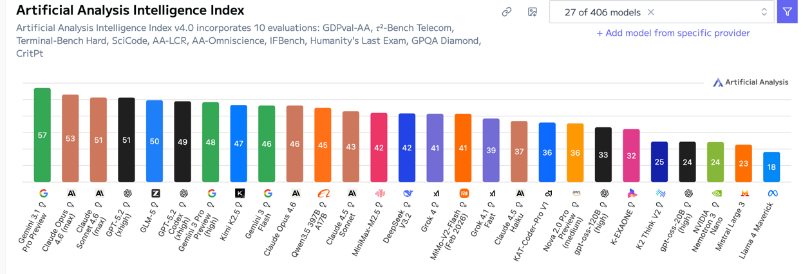
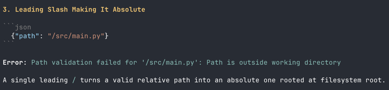
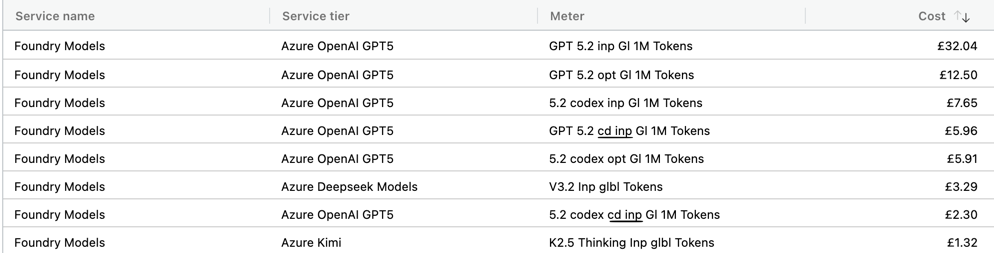
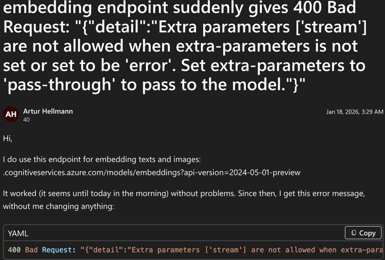

# The Mystique of Cheaper Models

When we started building AI agents on Azure West Europe, our options were limited. 
We had the last-generation GPT-4 series and a handful of top open-source models. 
Being someone who's always looking to get value for money, the open-source models were very tempting. 
The benchmarks looked impressive, the pricing was a fraction of what GPT-5 cost.

The thing is, cheaper open-source models aren't actually cheap — not when you're running them in agentic workflows. 
The hidden costs pile up fast: more tool errors, custom guardrails you never planned for, no prompt caching, and infrastructure that lets you down.

I'll try to break this down in the points below.

## Back & Forth and Tool Errors

In an agentic workflow, your model doesn't just answer a question and move on. It thinks, picks a tool, calls it, reads the result, and decides what to do next. Sometimes it loops through this cycle several times before it gets to an answer. Every one of those loops costs tokens.
The problem with cheaper models is they tend to loop longer to get the answer and their tool call error rate is higher. And when a tool call fails, the model doesn't just move on — it retries, sometimes with the exact same parameters, sometimes with something slightly different that also doesn't work. The token usage climbs and so does the cost.
Here's a real example. We tested Kimi 2.5, one of the top-rated open-source models.

## Need for custom tighter harness

Because cheaper models make more mistakes with tool calls, you end up building a whole layer of error handling that you never budgeted for. This isn't just a bit of extra code — it's an entire harness around the model to stop it from tripping over itself.
For instance, we had to explicitly craft error responses that told the model to try a different approach instead of retrying the same thing. Sounds simple enough, but without this, the model would happily call the same tool with the exact same parameters over and over, burning through tokens and getting nowhere. We also had to build tool call caching to catch these repeated calls and short-circuit them before they hit the API again.
DeepSeek V3.2 gave us a different headache altogether. It would collect all the information it needed to answer the question, and then just... keep going. It wouldn't stop and give you the answer. It kept calling tools, gathering more context it didn't need, running up the token count for no reason. We ended up writing custom logic to strip away its tool access after a certain number of iterations, essentially forcing it to stop researching and start answering.
None of this work was on our original roadmap. Every hour spent building guardrails for a cheaper model was an hour not spent building actual features. 

## No Prompt Caching

Prompt caching is one of those things you don't think about until you see the bill. The idea is straightforward — if the beginning of your request is the same every time, the provider recognises that and charges you less for those repeated tokens.
In an agentic loop, this matters a lot. Your system prompt, tool definitions, and schema stay the same on every single iteration. The only thing that changes is the conversation history growing with each loop. With GPT models, prompt caching kicks in automatically and you get a meaningful discount on all that repeated content.
Open-source models on Azure AI don't get this. For whatever reason, prompt caching simply isn't available for them. So every iteration is billed at full price.

There's a performance benefit too, not just cost. When a cache hit happens, the response comes back noticeably faster because the provider doesn't need to reprocess those prefix tokens.

## Reliability

This one isn't about the models themselves — it's about the infrastructure serving them. And to be fair, this is specific to Azure AI, so your experience might differ on other platforms.
The open-source models we used in the West Europe region had wildly inconsistent response times. The same request that took two seconds in the morning could take eight seconds in the afternoon. You can't promise a responsive experience when your model's latency is at the mercy of what time of day it is.
But the real wake-up call was when our embedding model went down. We were using Cohere Embed 4 through Azure AI for all our content embeddings — the backbone of our search and retrieval pipeline. One day it just stopped working, throwing 400 Bad Request errors with no warning. And it stayed down for two days.
Two days of our agents not being able to search or retrieve anything meaningful. We weren't the only ones hit either — other users reported the same issue on Microsoft's forums.

https://learn.microsoft.com/en-us/answers/questions/5723293/embedding-endpoint-suddenly-gives-400-bad-request

But I am not discounting the open-source models. In fact, I would very much like for them to succeed since they provide great value for money. 

And they do have a place in our stack. Right now, we use open-source models in our preprocessing pipeline where the work is straightforward — one-shot requests where we pass in a class and get back business context and technical explanations. No looping, no tool calls, no multi-step reasoning. For that kind of work, they're brilliant and the cost savings are real.
The trouble starts when you ask them to do more. The moment you put a cheaper model inside an agentic loop — where it needs to reason, pick tools, handle errors, and keep going until the job is done — the cracks start to show. And those cracks cost you more than the money you thought you were saving.

So here's my take after months of working with both: if you have access to a better model, use it for your agents, even if the sticker price is higher. The total cost — in tokens, engineering time, and reliability — will almost certainly be lower. Save the open-source models for your batch jobs, your preprocessing, and your one-shot tasks where they genuinely earn their keep.
The mystique of cheaper models is real. The benchmarks are impressive, the pricing is tempting, and the progress is genuinely exciting. But mystique fades when you're three weeks into building guardrails for a model that was supposed to save you money.