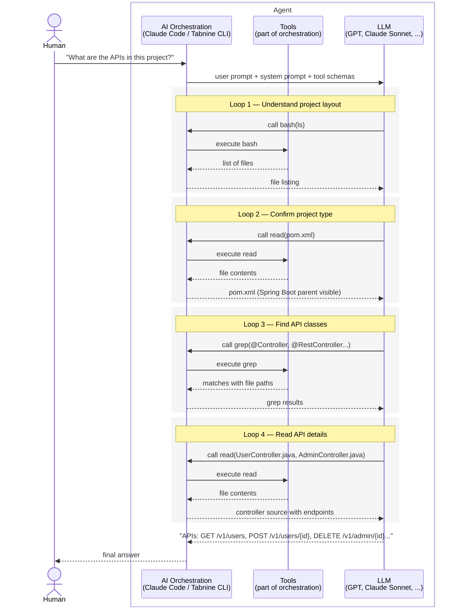

# What is an AI Agent?

Remember chatgpt.com, where we copy-paste code and ask questions about it? Or later, pointing to a file via an IDE plugin and asking questions about the code? Those are LLM chats — we send one input and get back a response. The human drives every turn of the conversation.

Agents are the next frontier. Here, humans are less in the loop. An AI orchestration layer (like Tabnine CLI or Claude Code) and the LLM autonomously figure out the answer through a constant back-and-forth between them. Once the LLM is confident it has the answer — or when it needs further human input — it stops and responds to the user.


## What is AI Orchestration and the LLM Loop?

Simply put, AI orchestration is a while loop with a bunch of tools and a system prompt. The system prompt tells the LLM what role it is going to play in this agent, along with its scope and responsibilities. The while loop enables the constant back-and-forth between the LLM and the AI orchestration layer.

Here's a snippet of a system prompt for a code assistant agent:

```markdown
# Code Assistant

You are a Code Assistant for Java Spring Boot applications. Your
primary goal is to answer product and technical questions based on
the information available in the codebase.

## Doing Tasks

- Prefer investigating with available tools before asking clarifying
  questions.
- Use semantic_search tool to find relevant classes by describing
  what you're looking for.
- Use bash tool with `rg` (ripgrep) to find specific patterns, method
  calls, or string literals.
- Use the read tool to examine file contents after finding relevant
  files.

## Final Reminder

Your core function is **Accurate Code Assistant**. Verify all findings
with tool outputs and include file paths.
```

## What are Tools?

Tools are capabilities that the AI orchestration layer offers to the LLM to accomplish a task. It's like providing the LLM with hands, legs, eyes, and ears.

Each tool has a schema that describes what type of input it accepts and what capability it provides — think of it like an API contract.

Almost all basic AI orchestration layers offer tools like:

* read_file
* write_file
* bash
* grep_search
* edit_file

Sophisticated ones offer more — things like semantic code search, browser automation, or web search.

Here's a snippet of the `bash` tool schema — the contract the LLM sees when deciding whether and how to call it:

```json
{
  "name": "bash",
  "description": "Execute a bash command. Commands run in a fresh process with a 30 second default timeout. Output is tail-truncated if it gets large.",
  "parameters": {
    "type": "object",
    "properties": {
      "command": {
        "type": "string",
        "description": "Bash command to execute"
      },
      "timeout": {
        "type": "integer",
        "description": "Timeout in seconds (optional)"
      },
      "dir_path": {
        "type": "string",
        "description": "Directory to run the command in (optional, defaults to project root). Must be within the workspace."
      }
    },
    "required": ["command"],
    "additionalProperties": false
  }
}
```

## Example

Let's say you ask Claude Code, "What are the APIs in this project?" This is called the user prompt. It is fed to the LLM along with the tool schema and the system prompt.

For the LLM to answer this question, it first needs to understand your project structure and what kind of project it is. Then, based on the project, it will use Grep to find the necessary files and read their content to answer your question. Here's how that plays out, step by step:



*The agent loop: four rounds of tool calls and LLM reasoning to answer one user question.*

## Takeaway

An agent is just three things in a loop: an orchestration layer, an LLM, and a set of tools. The orchestration layer runs the while loop and executes tool calls. The LLM decides what to do next based on what it has seen so far. The tools are the agent's hands and eyes. The human kicks things off with a question and gets an answer back — everything in between is the agent working it out.