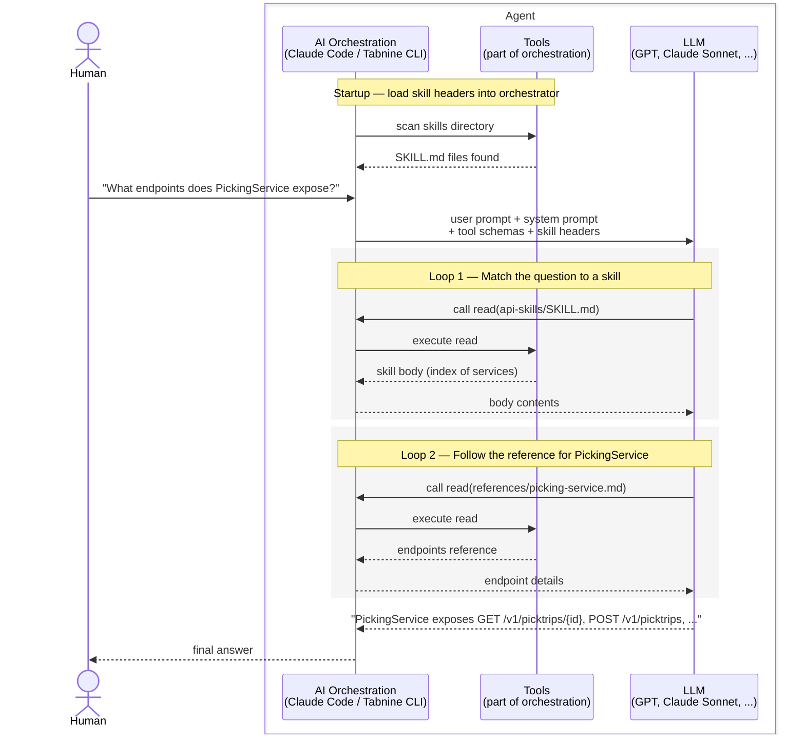

# What Are Agent Skills?

Ask Claude Code, "How do I call `PickingService` to create a pick trip?" and watch what happens. It has never heard of `PickingService`. It asks you where the service lives. You paste the repo path. It reads a handful of controllers, finds the endpoints, answers. Task done.

Next session, same question, same dance. You hand it the repo path again. It rediscovers the same files, rebuilds the same context, burns the same tokens to land on the same answer.

Recall from [What is an AI Agent?](https://kimihanif.github.io/2026/4/16/what-is-an-agent/) that an agent is an LLM + tools in a loop. The tools let it read files, grep, run commands. That's powerful when the answer is sitting in the current repo. It falls apart when the answer lives somewhere else — in a service you own but Claude doesn't see, in an internal API catalogue, in a domain glossary nobody checked into Git. The agent can't know what it can't reach.

Skills are how you hand the agent that missing knowledge — once, in a format it can discover on its own.

## What Is a Skill?

A skill is a Markdown file with a specific shape: a small header describing what's inside, a body with the actual knowledge, and — optionally — linked reference documents for detail that's too heavy to inline. Drop it in a directory the agent knows to look in, and it becomes part of the agent's knowledge on demand.

Two problems disappear at once. First, the knowledge gap: private APIs, internal domain concepts, anything outside training data now has a place to live where the agent can find it. Second, the rediscovery tax: the agent stops grepping its way to the same answer every session, which saves tokens, keeps the context window clean, and means you stop pasting the same docs over and over.

## Anatomy of a Skill

Let's look at a real skill I use: `api-skills`, which teaches the agent about the REST APIs of fourteen internal services. It has three parts.

### Header

The top of the file is YAML frontmatter:

```yaml
---
name: api-skills
description: API endpoint references for service repositories. Use when you need to understand, call, or integrate with any of the documented service APIs.
---
```

This is the part the agent reads at startup. It doesn't load the whole skill — just the header of every skill in the directory. The `name` identifies the skill; the `description` tells the agent when to reach for it. *"Use when you need to understand, call, or integrate with any of the documented service APIs"* is a direct instruction — if the user asks about an API, this is the skill to open.

### Body

Below the frontmatter is the body — a Markdown index of what the skill contains. For `api-skills`, that means one entry per service:

```markdown
### PickingService
PickingService exposes APIs for managing pick trips, tray identifiers,
fulfilment point configuration, statistics, and buffer operations across
fulfilment points...
- [Endpoints](references/picking-service.md)
- [Schemas](references/picking-service-schemas.md)

### LogisticUnitService
LogisticUnitService provides versioned (v2/v3) APIs for logistic-unit
optimization, store configuration, store map parameters...
- [Endpoints](references/logistic-unit-service.md)
- [Schemas](references/logistic-unit-service-schemas.md)
```

One paragraph per service, then links to the reference files. The body is an *index*, not the whole story.

### Reference files

The endpoints and schemas for `PickingService` — path, method, request body, response body, every field — live in `references/picking-service.md` and `references/picking-service-schemas.md`. The body doesn't duplicate them. It links to them.

This is **progressive disclosure**: the skill body stays small enough to fit cheaply in context, and detail is loaded only when it's needed. If the user asks *"what endpoints does PickingService expose?"*, the agent reads `references/picking-service.md`. It does not load the other thirteen services. It does not load the schema files unless the question goes deeper. Fourteen services' worth of API surface becomes available to the agent, but only the slice relevant to the current question actually enters the conversation.

Skills can also ship **scripts** — executables the agent runs on demand to fetch dynamic info that doesn't belong in a static document. That's a more advanced pattern; this post sticks to the static shape.

## How Does the Agent Use It?

At startup, the orchestration layer scans the skills directory and collects the frontmatter of every SKILL.md it finds. Nothing is sent to the LLM yet — the headers just sit with the orchestrator, ready. When the user asks a question, the orchestrator bundles everything together and sends it in one shot: system prompt + tool schemas + every skill's header + the user's prompt. The LLM sees the full menu of available skills the moment it starts thinking.

Say the user asks, *"What endpoints does PickingService expose?"* Here's how it plays out:



*Two reads. You were never asked for a repo path. The agent pulled in exactly the one reference file it needed, and the other thirteen services stayed on disk.*

Compare that to the opening scene — you hand over the repo path, the agent rediscovers the same files, rebuilds the same context, every session. The difference isn't that the LLM got smarter. The difference is that the knowledge it needed was written down once, in a shape it could find on its own.

## More Skills

Here are two more skills I use. The first gives the agent reference material of a different kind; the second is procedural — teaching it *how to do* something rather than *what something is*.

`repo-skills` documents what each service does — the Kafka topics it consumes, the data stores it writes to, its upstream and downstream dependencies:

```yaml
---
name: repo-skills
description: Per-service integration and data flow documentation for FPS domain services. Use when you need to understand what a service does, how it connects, or the upstream/downstream impact of changes.
---
```

`splunk-skills` is the procedural flavour. It hands the agent canonical Splunk SPL queries for investigating each service's external interactions:

```yaml
---
name: splunk-skills
description: Canonical Splunk SPL queries for each external interaction (consumed Kafka events, produced Kafka events, REST endpoints) of a service. Use when you need a copy-paste query to investigate production behaviour for a specific service or integration point.
---
```

Ask *"what did PickingService consume from Kafka in the last hour?"* and the agent opens `splunk-skills`, finds the right query for PickingService's consumed events, and runs it. Same file shape — header, body, references — but the body is a recipe rather than a fact. CLI tooling, in-house deploy scripts, and runbook procedures all fit this flavour too.

If it's structured knowledge your agent needs on demand, it can be a skill. Internal APIs, service architecture, runbooks, domain glossaries, SQL query patterns, custom CLIs — all fit.

## Takeaway

Skills flip the model. Without them, the agent knows only what it was trained on plus whatever it can grep in the current repo — and every session starts from zero. With them, the agent knows whatever you've bothered to write down, organised so it can find the right piece at the right time without dragging the rest into context.

One Markdown file. A header, a body, optional references. That's the whole pattern.

---

**Further reading:** [agentskills.io/specification](https://agentskills.io/specification) — the standard format spec for skills.
