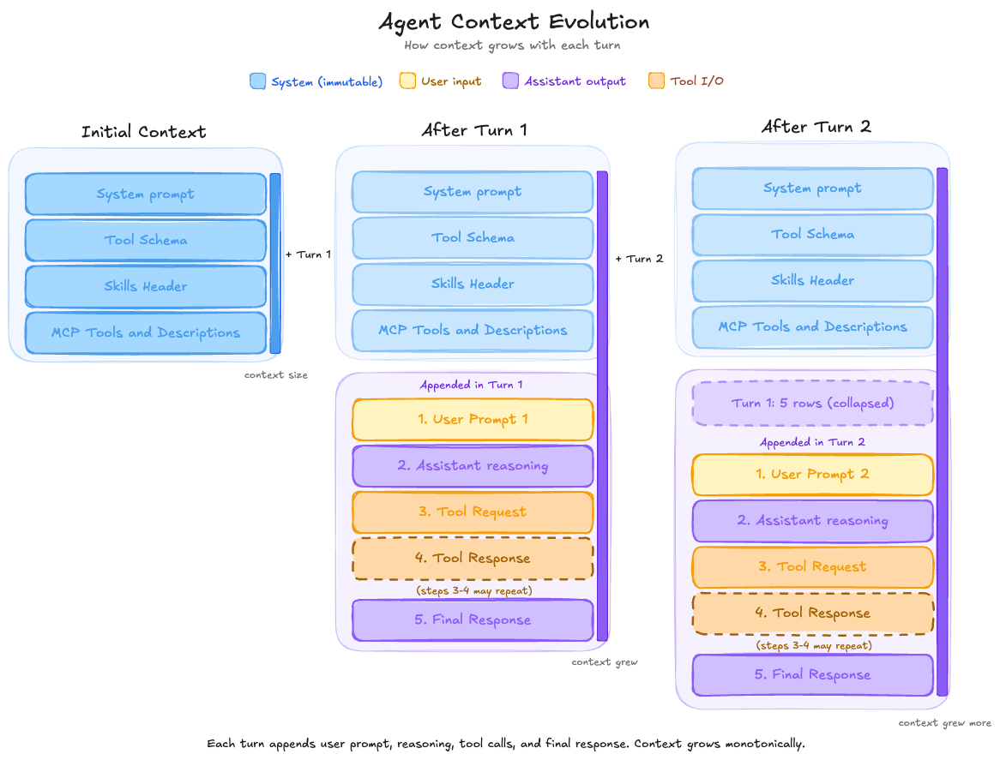
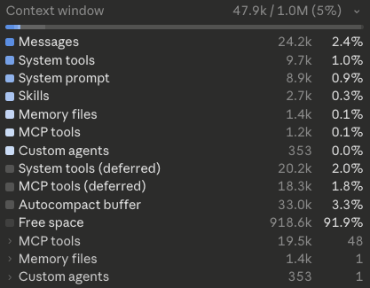

# Understanding Agent Context

You've probably noticed agents get fuzzier the longer a session runs — losing track of details, repeating steps, drifting from the original task. That comes down to how the agent's context fills up over time. Once you understand that, you can structure your sessions to get sharper answers.

## What is Agent Context?

Agent context is the little brain space for the LLM — its working memory, the set of tokens it can hold at one time. (A token is roughly 4 characters of English text, or about ¾ of a word.)

Why I say "little" — unlike the human brain, which can hold vast amounts of data, LLMs typically work with 200–300k tokens of context. The latest models advertise 1M-token windows (usually at extra cost). And even then, you can't really use the full length effectively — more on that shortly.

## What does Agent Context typically hold?

When the agent starts up, the context already has a few things in it:

- The system prompt
- Tool schemas
- Skill headers (optional)
- MCP details (optional)

Once the user sends a message, the agent enters a loop with the LLM (see my previous post, [What is an AI Agent?](https://kimihanif.github.io/2026/4/16/what-is-an-agent/)). Each turn through the loop adds more to the context:

1. The user message
2. Assistant internal response
3. Tool request
4. Tool response
5. The final LLM response to the user

Steps 2–4 repeat with each loop iteration until the LLM is ready to respond. Then the user replies again, and the whole thing keeps stacking up — previous turns plus new loop traces.

*The agent context starts with system blocks only. Each turn appends the user prompt, the assistant's reasoning, any tool calls, and the final response — and nothing ever gets removed. Context grows monotonically.*

Here's what this looks like in practice — Claude Code's own context window breakdown:

*A real example from Claude Code: messages, system prompt, tools, skills, and MCP all stacked up, with live token counts. Note the split between active and deferred tools — some agents lazy-load schemas to save tokens.*

## Quality Degradation and Cost Increase

As the context grows, two things happen — and neither is great.

### Quality drops

Just like the human brain — the LLM's response degrades as we pile more things into the day, compared to early morning freshness. The LLM has to weigh every previous token when generating the next one, and more tokens mean more noise to filter through. This phenomenon is often called *context rot*.

### Cost rises

LLMs are stateless, so the agent has to send the entire context back to the LLM on every loop iteration. Providers bill per token sent *and* per token returned, so a long-running session quietly multiplies your bill — you pay for the same early tokens over and over again.

## What Happens When the Context Gets Full?

Most agent harnesses let the context fill to about 80% of the maximum before a process called **compaction** kicks in.

Compaction works like this: the harness sends the entire current context to the LLM and asks it to summarize — like writing the synopsis of an essay. It then evicts most of the old content (keeping the system prompt and other startup blocks) and replaces it with the summary plus the last ~30k tokens of recent activity. The recent slice is kept verbatim because that's where the immediate task state lives — what the agent was just doing.

The exact size of that recent slice (30k here) is arbitrary and varies by harness. In Claude Code, this is what `/compact` runs manually.

## Context Best Practices

1. **Start a new session for unrelated tasks.** Don't continue a session just because it's already open — every leftover token costs you quality and money.

2. **Split your tasks** so the agent can finish each one within ~70% of the context window. Past that, quality starts slipping and you're racing compaction.

3. **Compact early, before quality drops.** If you sense the agent getting fuzzier, trigger compaction yourself rather than waiting for the auto-trigger.

4. **Use sub-agents for long-running tasks.** Sub-agents run in their own context and return only their final answer to the parent — keeping the parent's context lean. This is an advanced topic for a future post, and not all harnesses support it.

## Takeaway

Agent context is the LLM's working memory, and it fills up faster than you'd think — system prompt, tool schemas, every user message, every tool call, every response, all of it. As it fills, answers get worse and bills get bigger. Compaction buys you more runway, but the real win is keeping sessions focused and tasks small in the first place.
