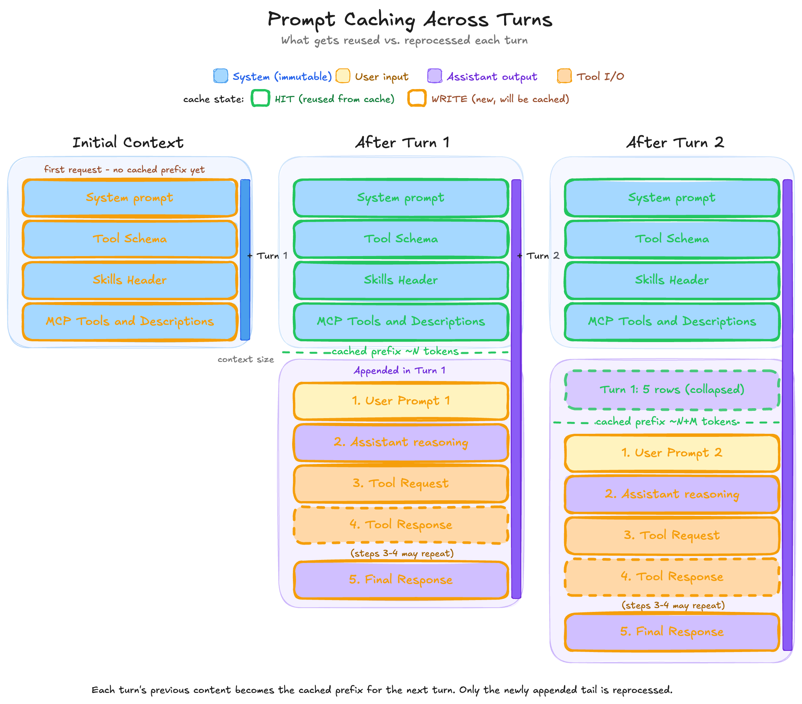

# Prompt Caching: Stop Paying for the Same Tokens Twice

Every API call to an LLM re-sends everything before it — the system prompt, the tool schemas, every previous turn. The model is stateless, so the only way it remembers is if you remind it. In a long session, that bill compounds fast.

I unpacked this in [Understanding Agent Context](https://kimihanif.github.io/2026/4/28/agent-context/) — the same early tokens get resent on every turn and get re-billed. Model providers devised a solution and built a way out: **prompt caching**.

## What is Prompt Caching?

Prompt caching is server-side caching of the request prefix. When you send a request, the provider hashes the start of it. If a previous request started with the same tokens, the request is routed to the same machine, and the cached result for that prefix is reused instead of recomputed. The model only does fresh work on whatever's *new* at the end of the request.

You don't manage the cache. You don't invalidate it. You just structure your prompts so the cache can do its job.

## Why It Matters

Skipping reprocessing of the prefix gives you two things.

### Latency

Latency on the cached portion of the request can drop by up to **80%**. The longer your static prefix relative to the dynamic tail, the bigger the win.

### Cost

Providers pass the saving on. Cached input is billed at roughly **1/10th** the price of fresh input. Here's a snapshot from a current price card:

*Cached input ($0.50 / $1.00) is 10× cheaper than fresh input ($5.00 / $10.00). Output isn't cached — that's always recomputed.*

The exact numbers move; the 10× ratio is the part worth remembering.

## What Gets Cached (and What Doesn't)

A request to an LLM has a predictable layout, top to bottom:

1. Tool schemas
2. System prompt
3. Files and other project context
4. User prompt
5. Assistant messages
6. Tool requests
7. Tool responses

Caching matches **token-for-token from the top of the request**. The match runs as far down as the tokens are identical to a previous request, then stops at the first byte that differs. Everything from that point down is reprocessed at full price.

Items 1–3 are the part *you* control as an app or agent harness author. Items 4 onwards are dynamic by nature — the user types something different every turn. So the game is: keep the top static, push everything dynamic below it.

## Cache Across Turns

Here's how the cached prefix grows turn by turn within a single session:

*Each turn's previous content becomes the cached prefix for the next turn. Only the newly appended tail is reprocessed — and once reprocessed, it joins the cached prefix for the turn after that.*

Turn 1 pays full price for the system blocks (cache write). Turn 2 reads them back at 1/10th cost (cache hit) and pays full price only for what Turn 1 appended. Turn 3 reads all of that back, and only pays for Turn 2's tail. The cached prefix grows monotonically; the freshly billed slice stays small.

## How to Actually Benefit From It

To make caching fire, the top of your prompt has to be **identical** across requests — byte for byte. That sounds obvious, and it's where most of the wasted spend comes from.

The classic mistake: putting dynamic content high up in the prompt. A system prompt that opens with `Today is 2026-05-05` looks harmless until you realise the prefix changes every day, and your cache hit rate quietly collapses overnight. Same for per-request file paths, draft IDs, user names, anything that mutates between requests.

The rule:

- **Static at the top** — system prompt, tool schemas, persistent context.
- **Dynamic at the bottom** — push variable data into the user message or further down.

If you need the model to know today's date, tell it in the user turn, not the system prompt.

## Cache Retention

Caches don't live forever. Retention varies by provider and tier:

| Provider  | Model           | Retention                                   |
|-----------|-----------------|---------------------------------------------|
| OpenAI    | GPT 5.5         | ~24 hours                                    |
| Anthropic | Claude Opus 4.7 | 5 minutes default, 1 hour on a paid tier    |

Each cache hit renews the TTL — so a frequently-used prefix stays warm indefinitely. A prefix that goes quiet for longer than the retention window gets evicted, and the next request pays the full write cost again. Check your provider's docs for current numbers; these drift.

## Under the Hood

A quick mechanical sketch, in case you want it:

1. **Threshold.** Caching only kicks in above a minimum prefix length (around 1024 tokens for Anthropic). Shorter prompts aren't worth caching.
2. **Routing.** A hash of the first ~256 tokens of the request picks which machine handles it. Same prefix → same machine, every time.
3. **Lookup.** The chosen machine checks whether the prefix is in its local cache.
4. **Hit.** Prefix found — reuse it, only process the new tail.
5. **Miss.** Prefix not found — process the full request, write the prefix to that machine's cache for next time.

You don't call any of this directly. It's automatic, as long as your prefix qualifies and your tokens line up.

## Takeaway

Prompt caching is free money on the table — *if* you structure your prompts to claim it. Static at the top, dynamic at the bottom, and the same byte-for-byte every request. Get that right and your input bill drops by an order of magnitude on every turn after the first.

It's not a substitute for keeping context lean — a cached bloated context is still a bloated context, and [quality still degrades as it grows](https://kimihanif.github.io/2026/4/28/agent-context/). But for the tokens you *do* need to send, caching is the difference between paying once and paying every turn.
