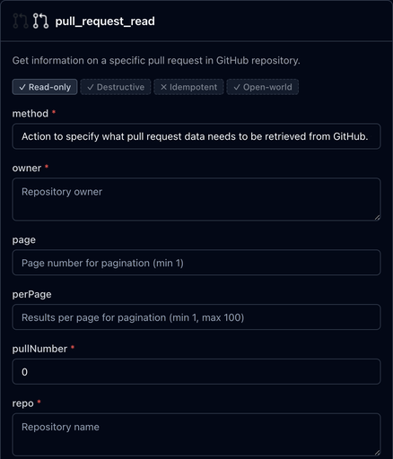
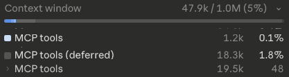

# What Is an MCP? — Tools, Tradeoffs, and When to Use One

An agent harness ships with a default set of tools — `Bash`, `Read`, `Write`, `Edit`. They cover most of what a coding agent needs. But what happens when you want behaviour those tools can't give you out of the box?

That's where **MCP** — Model Context Protocol — fits in. An MCP server exposes a bundle of specialised tools the agent can call. Want your agent to fetch a PR's review comments from GitHub? Add the GitHub MCP server, and the agent gets a set of GitHub-shaped tools to do exactly that.

Each MCP tool has a fixed input schema, a fixed output shape, and a description telling the agent what it does — same contract as any built-in tool.

So you add the MCP, you get the functionality, everyone's happy. What's the catch?

## So What's the Catch?

*The official `ghcr.io/github/github-mcp-server` (v1.0.3) exposes 41 tools — captured from the [MCP Inspector](https://modelcontextprotocol.io/docs/tools/inspector).*


*The `pull_request_read` tool's input schema as shown by the inspector.*



Recall from [Understanding Agent Context](https://kimihanif.github.io/2026/4/28/agent-context/) that everything in the agent's context gets re-sent on every turn. MCPs interact with that fact in two unfortunate ways.

### 1. Tool schemas occupy context whether you use them or not

The moment you register an MCP server, every one of its tools — its name, its input schema, its description — gets loaded into the agent's context. The official GitHub MCP server brings **41 tools** with it. Each one carries its own schema and description. All of that sits in the prompt on every turn, billed every turn, whether the agent ever calls a single one of them.

Add three or four MCPs and the static overhead piles up fast. You've quietly handed thousands of tokens of tool definitions to a model that might never use most of them.

### 2. You can't control how much they return

MCP tools have fixed output shapes. You take what they give you.

Say you just want the title of a PR. The GitHub MCP doesn't expose a `get_pr_title` tool — and it won't, because nobody ships a tool that narrow. So you reach for `pull_request_read` instead, which is the *consolidated* tool covering most PR reads (a single tool whose `method` field picks which read operation to run — fetch the PR, list reviews, list files, and so on). It dumps the full PR object into your context: title, description, every label, every reviewer, the head and base refs, the merge state, the file count. You wanted one string; you got a wall of JSON.

The `Bash` tool, with the agent picking the right `gh` invocation, would have fetched exactly that one string:

```bash
gh pr view 123 --json title --jq .title
```

Bloated context isn't just a context problem. It costs more tokens, slows the response, and — as covered in [Understanding Agent Context](https://kimihanif.github.io/2026/4/28/agent-context/) — quietly degrades the quality of the agent's reasoning.

*A real Claude Code `/context` view: 48 MCP tools sit at ~19.5k tokens (active + deferred), paid every turn whether the agent calls them or not.*



## What Is the Alternative?

There are several alternatives. I'll cover one in this post: the combination of **Skill (optional) + CLI + Bash tool**.

Take our GitHub example. The agent can use `gh` CLI inside the `Bash` tool to fetch exactly the slice of GitHub data we need — title, description, labels, whatever — without any of the schema overhead. Want just the title?

```bash
gh pr view 123 --json title --jq .title
```

One line in, one string out. Compare that to `pull_request_read` returning the entire PR object.

In this case, no skill is needed for the CLI itself — `gh` is well-known and already lives in the LLM's training data ([more on skills here](https://kimihanif.github.io/2026/4/22/what-are-agent-skills/)).

A skill becomes useful only when the CLI is obscure — and even that gap is closing. Modern agents will happily run `<cli> --help` against an unfamiliar tool, read the output, and figure it out on the fly. The skill is a shortcut for repeated use, not a hard requirement.

## So Is MCP All Bad?

No. MCP earns its place in three situations.

### 1. Credential encapsulation

An MCP server holds the credentials. The agent calls a tool; the server makes the authenticated request on its behalf. The credentials never enter the agent's context, which means they can't be exfiltrated through a prompt injection or accidentally logged. For anything touching production secrets, that's a meaningful security boundary.

### 2. Stateful interactions

MCP servers can hold state between calls; a stateless `Bash` invocation can't easily do that. The Playwright MCP is the canonical example — it holds a live browser session for the agent, so `navigate`, `click`, and `extract` all run against the same page with cookies, login, and JS state preserved across calls. A `Bash`-only equivalent would have to spin up a fresh headless browser each call or stash the cookie jar to disk between invocations. The same shape applies to paginated cursors, long-running job handles, and interactive REPL sessions.

### 3. No CLI or API exists

Sometimes the functionality you need simply doesn't have a CLI or a public API behind it. An MCP server may be the only way to expose it to the agent at all.

## Takeaway

MCP is a powerful extension point, but it's not free. Every server you add taxes your context with schemas and descriptions the agent may never use, and forces you to accept whatever output shape its authors chose.

Before reaching for an MCP, ask: **does a CLI already do this?** If the answer is yes, the `Bash` tool with a well-known CLI gives the agent finer control, smaller context, and the same result. Keep MCP for the cases where it earns its weight: secret-handling, stateful protocols, or capabilities that have no CLI to call.
