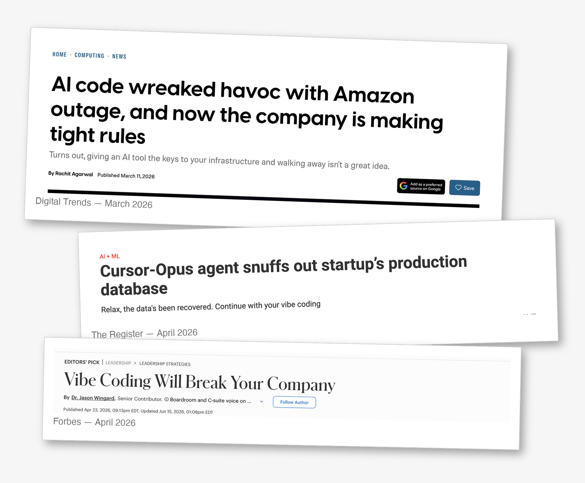

# Vibe Coding Is Here, but Are Our Systems Ready?

Most of us are already doing agentic coding daily. And it's an addictive tool — like a slot machine. We pull the lever hoping for a certain output; if we don't get it, we pull again, and again, each pull leaving a little less room for our own thinking. Not unlike Instagram Reels or YouTube Shorts.

I'm not saying it isn't a productive tool. But the line between being productive and ending up in bugs and spending more and more time is thin, and we end up on the wrong side of it more often than we'd like, even with the best intentions.

This behavior has unintended consequences for teams and their software, and it snowballs: small at first, then increasingly serious for quality.

The internet already has plenty of examples from companies at the front of the agentic-coding wave.

*Sources: [Digital Trends](https://www.digitaltrends.com/computing/ai-code-wreaked-havoc-with-amazon-outage-and-now-the-company-is-making-tight-rules/), [The Register](https://www.theregister.com/2026/04/27/cursoropus_agent_snuffs_out_pocketos/), [Forbes](https://www.forbes.com/sites/jasonwingard/2026/04/23/vibe-coding-will-break-your-company/)*

And I've seen the anecdotal evidence myself, as a silent observer on my current cross-team project. Going over the sessions of our code review agent, the number of lines per PR has drastically increased. There are more and more test cases, but simplicity has taken a back seat, and I'd argue those extra test cases offer *less* value than the smaller, deliberate ones we wrote before AI.

Companies that aren't at the bleeding edge have one real advantage here: they can see over the horizon and still have time to act. Whether they act is the difference between this being a tsunami or a wave the team can enjoy.

So how do we prevent it? Expecting everyone to be on their best behavior all day, every day, is not realistic. And the answer isn't rules on paper or software delivery freezes either — those are band-aids at best, and they come off within days. Nor is it more code review: manual review doesn't scale to AI-sized PRs, and AI reviewing AI just adds another slot machine to the loop. We have to invest in our teams and systems — to ease the process and act as a safety net.

How exactly? My full answer deserves its own post, and I don't want to rob you of your own thinking towards a solution. But here's the direction I'm looking in.

I take inspiration from my favorite sport: Formula 1. What separates a great F1 team from a good or a bad one? It almost always comes back to correlation — how closely the simulations and wind-tunnel testing of a scaled-down car match real on-track data, and how short and cheap that feedback loop is. Or look at the space industry: you can't test everything with a live launch, because you can't afford to blow up a rocket every time.

Turning that analogy back to software, three questions come to mind:

- How close are our environments to our customers' environment?
- How long are our feedback and verification loops?
- How easy are these systems to actually use?

The answer, I suspect, lies in mixing age-old engineering practices with a modern twist — one that meets the scale and maintenance demands of this new age.
